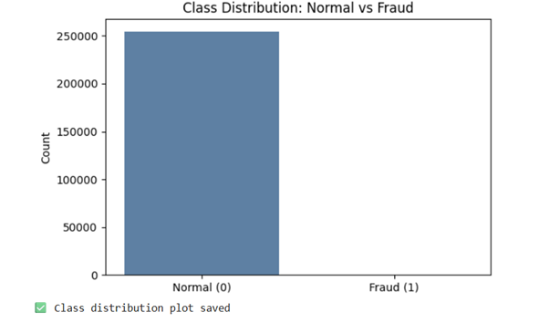
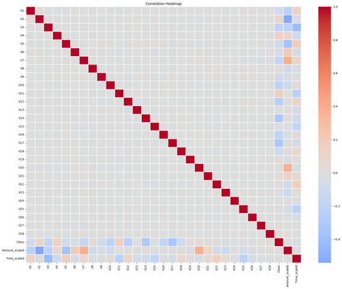
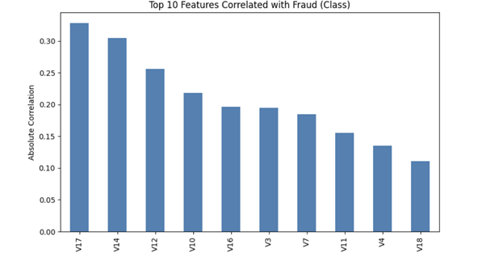
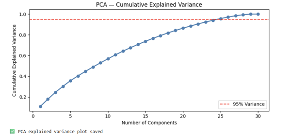
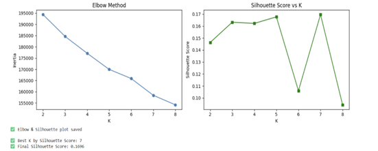
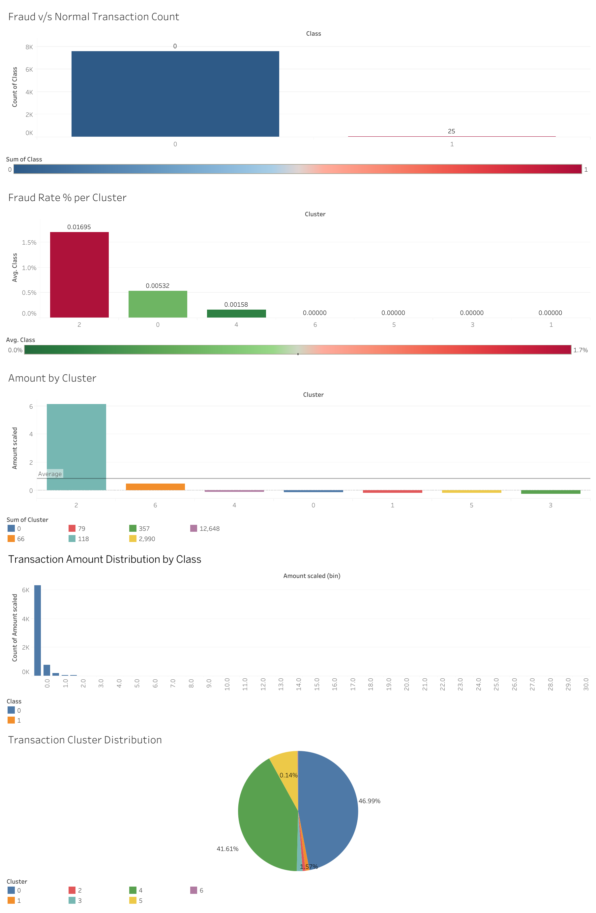

# Credit Card Fraud Detection


Comprehensive end-to-end pipeline for detecting fraudulent credit card transactions using data cleaning, statistical analysis, dimensionality reduction (PCA), and unsupervised machine learning (K-Means).

## 📌 Project Overview
The goal of this project is to identify fraudulent transactions from a dataset of over 284k records. The workflow spans four distinct phases, leveraging the strengths of different tools to move from raw data to actionable interactive insights.

- **Domain**: Finance / Fraud Detection
- **Dataset**: [Kaggle Credit Card Fraud Detection](https://www.kaggle.com/datasets/mlg-ulb/creditcardfraud)
- **Scale**: 284,807 rows × 31 columns


## The Team 

- [Darren Samuel Dcruz](https://github.com/Darren-Dcruz)
- [Irene Ajay K](https://github.com/irene-ajay)
- [Joel Jacob Roji](https://github.com/JoelJacobRoji)

## Live Deployment 


[Live Tableau Dashboard](https://public.tableau.com/views/IDS_phase4/CreditCardFraudAnalysisDashboard?:language=en-GB&:sid=&:redirect=auth&:display_count=n&:origin=viz_share_link)


## 🚀 Methodology

### Phase 1: Data Understanding & Cleaning (R)
Primary tool: **R (tidyverse, skimr, janitor)**
- Data exploration (summary stats, distributions).
- Handling 100% of missing values via median imputation.
- Removal of duplicate records.
- Feature scaling for 'Time' and 'Amount' (normalizing raw data for modeling).
- 80/20 train-test split for validation.

### Phase 2: EDA & Initial Modeling (R + Python)
- Correlation analysis to identify top predictors of fraud.
- Implementation of **Logistic Regression** in R for baseline fraud prediction.
- Performance evaluation using ROC and AUC scores.
- Introduction of Python-based EDA using Seaborn and initial K-Means elbow method testing.

#### Outputs




### Phase 3: Python Implementation & Dimensionality Reduction
Primary tool: **Python (NumPy, Pandas, Scikit-Learn)**
- Advanced feature engineering and High-Value transaction labeling.
- **Principal Component Analysis (PCA)**: Reducing 30 features into principal components while retaining 95% variance.
- **Unsupervised Learning**: K-Means clustering applied to PCA-reduced dimensions.
- Fraud rate analysis per cluster to identify high-risk segments.

#### Outputs



### Phase 4: Visualization & Dashboarding (Tableau)
Primary tool: **Tableau**
- Construction of a multi-panel interactive dashboard.
- Features: Fraud vs. Normal distribution, Average Amount by Cluster, and Fraud Rate % by Cluster.
- Dynamic filters for cluster-based exploration of transaction patterns.

#### Outputs



## 🛠️ Installation & Requirements

### R Packages
```r
install.packages(c("tidyverse", "skimr", "janitor", "corrplot", "pROC"))
```

### Python Environment
```bash
pip install numpy pandas scikit-learn seaborn matplotlib
```

## 📂 File Structure
- `Project Flow.html`: Interactive visual roadmap of the project.
- `Phase 1.R`: R script for data cleaning and preprocessing.
- `Phase 2 & 3.ipynb`: Jupyter Notebook containing Python EDA, PCA, and Clustering.
- `Phase 4.twbx`: Tableau Packaged Workbook for the final visual report.
- `creditcard.csv`: (Not included) Raw transaction data.

---
*Created as part of a Introduction to Data Science project.*
